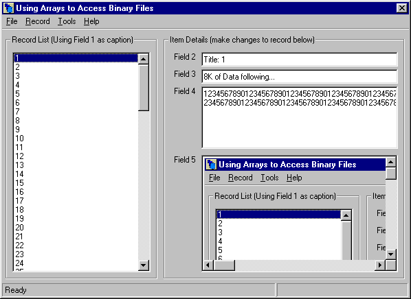



## Arrays and Binary File Access Version 2

### Description

This project demonstrates how to use a dynamic array to interact with database records and settings stored in a single binary file. The example stores custom settings and the record count at the beginning of the binary file, then stores multiple database records. To retrieve the data, it gets the settings and record count, then loads the records into a dynamic array which can be interacted with on the form, much like a true database record. If that's not enough, then how about the ability to embed images directly into records!
 
### More Info
 
This code was created with VB6 SP5.

Larger images will (of course) take longer to load and save.

             |
---                |---
**Submitted On**   |2002-07-12 12:55:14
**By**             |[Jim Hunt](https://github.com/Planet-Source-Code/PSCIndex/blob/master/ByAuthor/jim-hunt.md)
**Level**          |Intermediate
**User Rating**    |4.5 (27 globes from 6 users)
**Compatibility**  |VB 6\.0
**Category**       |[Data Structures](https://github.com/Planet-Source-Code/PSCIndex/blob/master/ByCategory/data-structures__1-33.md)
**World**          |[Visual Basic](https://github.com/Planet-Source-Code/PSCIndex/blob/master/ByWorld/visual-basic.md)
**Archive File**   |[Arrays\_and1053877122002\.zip](https://github.com/Planet-Source-Code/jim-hunt-arrays-and-binary-file-access-version-2__1-36839/archive/master.zip)

### API Declarations

Several User-Defined Types, GetPixel, SetPixel, VarPtrArray, CopyMemory, GetObjectAPI

